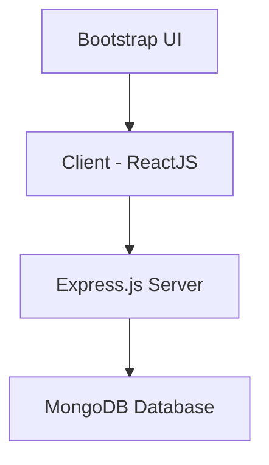

# Todo List App Architecture



## Components

### Frontend (ReactJS)
- Built with Create React App
- Uses functional components with hooks
- Communicates with backend via REST API
- Styled with Bootstrap for responsive design

### Backend (Node.js + Express)
- RESTful API server
- Handles CRUD operations for todos
- Connects to MongoDB using Mongoose
- Runs on port 5000

### Database (MongoDB)
- Stores todo items
- Database name: `todo-list`
- Collection name: `todos`
- Document structure:
  ```javascript
  {
    _id: ObjectId,
    text: String,
    completed: Boolean,
    createdAt: Date
  }
  ```

## Data Flow

1. User interacts with React frontend
2. Frontend makes HTTP requests to Express backend
3. Backend processes requests and communicates with MongoDB
4. MongoDB stores/retrieves data
5. Backend sends responses back to frontend
6. Frontend updates UI based on responses

## API Endpoints

| Method | Endpoint             | Description           |
|--------|----------------------|-----------------------|
| GET    | /api/todos           | Get all todos         |
| POST   | /api/todos           | Create a new todo     |
| PUT    | /api/todos/:id       | Update a todo         |
| DELETE | /api/todos/:id       | Delete a todo         |
| GET    | /api/todos/search/:query | Search todos      |

## File Structure

```
todo-list-app/
├── client/
│   ├── public/
│   │   └── index.html
│   └── src/
│       ├── App.js          # Main application component
│       ├── App.css         # Custom styles
│       └── index.js        # Entry point
├── server/
│   └── server.js           # Express server and API routes
├── package.json            # Dependencies and scripts
├── README.md               # Project documentation
└── MONGODB_SETUP.md        # MongoDB installation guide
```